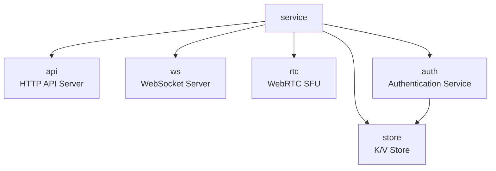
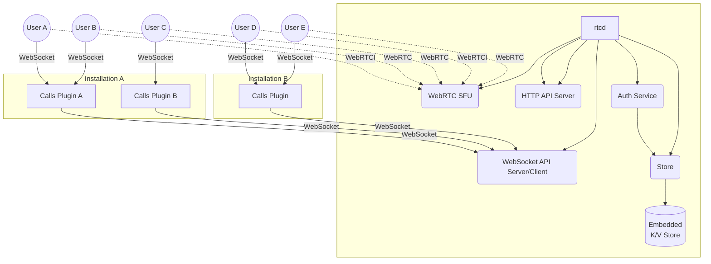

# Implementation Notes

This documents contains an overview of the most important implementation details for the `rtcd` service
It's important to note that this service is currently meant to be interfaced only by the [Mattermost Calls plugin](https://github.com/mattermost/mattermost-plugin-calls).

## Components

These are the main components (packages) that form the `rtcd` service:

### `service`

This is the main entry point to a singleton service that handles everything needed to setup and run a fully functional service.
It's the higher abstraction layer available (excluding the CLI command).

### `api`

The `api` package implements a basic HTTP(s) server. This is decoupled from the actual business logic which is injected through the use of handlers by the higher level (`service`).

### `ws`

The `ws` package provides implementations for both WebSocket client and server. Only the server is used by the `service`. The client is provided to be imported externally (e.g. by Calls plugin) and for testing.

### `rtc`

The `rtc` packages provides implementation for a WebRTC [SFU](https://webrtcglossary.com/sfu/).

### `auth`

The `auth` packages implements a simple authentication service to register, unregister and authenticate clients.

### `store`

Store provides a basic interface to key-value store. Its main implementation is currently based on [bitcask](https://git.mills.io/prologic/bitcask), a persistent embedded key-value store.

## Sample deployment

