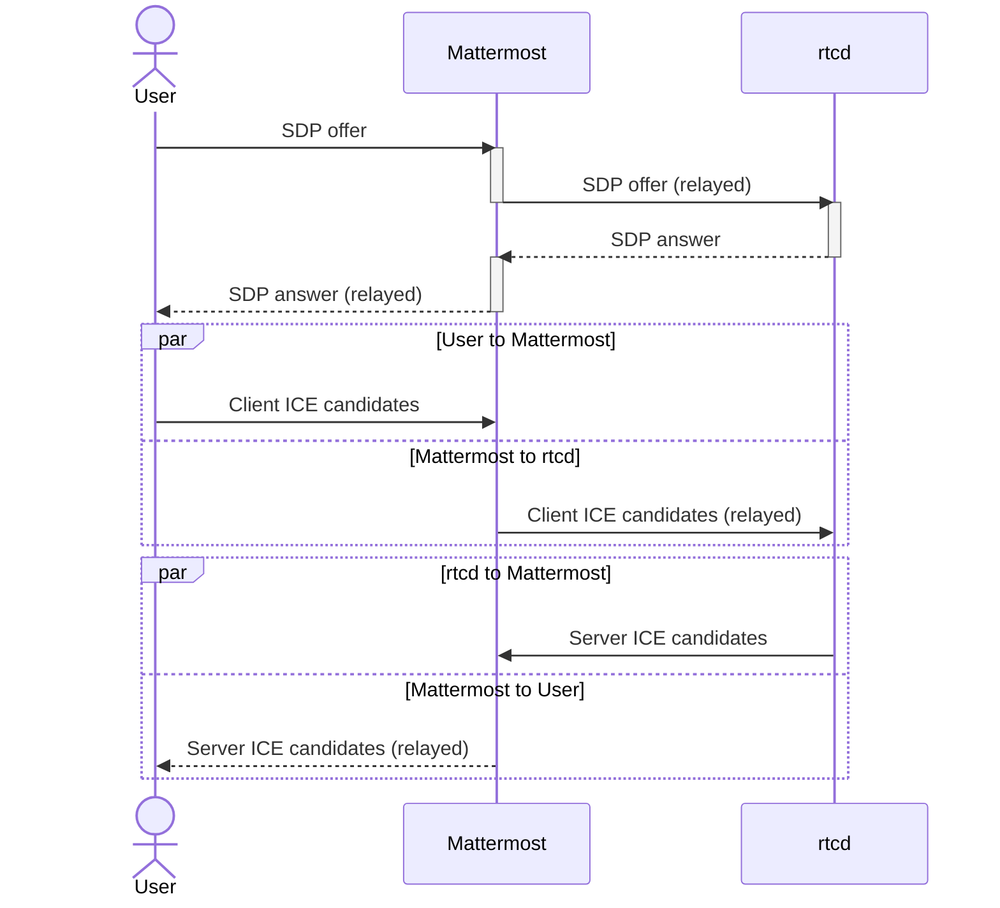

# Security

## API (HTTP/WebSocket)

### Authentication

The authentication flow is as follows:

#### Registration

1. Client makes a request for registration by providing a JSON payload containing a random string which uniquely identifies the client (clientID) and an authentication key (authKey). 
2. Server calculates a hash (bcrypt) for the authentication key and saves it to the embedded persistent k/v store, mapping to the provided client id.
3. On success server returns a JSON response payload with the clientID and HTTP code 201.

#### Client Authentication

1. Client makes a request for authentication by providing its client id and associated auth key through HTTP basic auth.
2. Server fetches the saved hashed key from the embedded persistent k/v store for the given client id.
3. Server calculates the hash for the client provided auth key and compares it to the stored value.
4. Authentication is considered successful if the comparison operation returns no error.

## RTC (WebRTC)

WebRTC channels are secured through the standard signaling process. SDP messages and ICE candidates are sent and received through a secured WebSocket channel, as follows:

For detailed technical information on the security of the WebRTC standard please refer to:
 - [WebRTC Security](https://webrtc-security.github.io/)
 - [Security Considerations for WebRTC](https://datatracker.ietf.org/doc/rfc8826/)
 - [WebRTC Security Architecture](https://datatracker.ietf.org/doc/rfc8827/)
